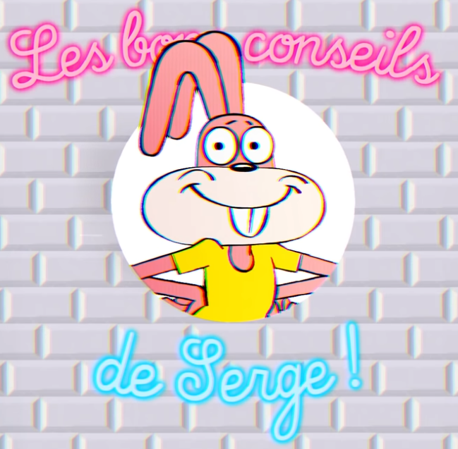

# Rust From Scratch

Rust From Scratch est une série de vidéo faites par [@Imilnb](https://twitter.com/iMilnb) sur la découverte du langage Rust.

La méthode convient plutôt bien à des personnes connaissant bien le C et cherche a expliquer ce que fait le compilateur Rust en regardant 
comment celui-ci gère la mémoire virtuelle.
L'objectif est aussi d'expliquer le plus possible les choses sans jamais assener des vérités.

## Explication sur les Result

Suite aux questions de [@lea_linux](https://twitter.com/lea_linux)

Ce repository contient des exemples de code pour bien comprendre la notion de Result.
Avec Serge le lapin du métro. Référence aux [Kassos](https://www.youtube.com/watch?v=vS2e7VkDctY) (:warning: NSFW)

N'hésitez pas à créer des issues si vous avez des questions ou une PR si il y a des erreurs.
